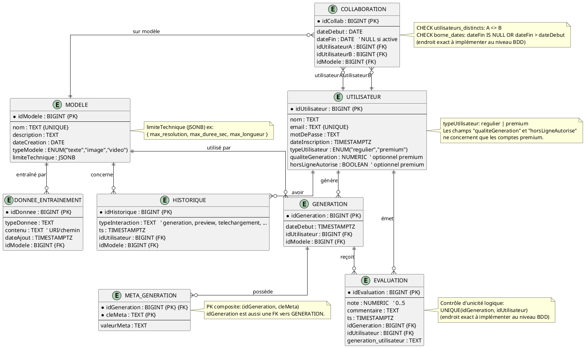

```plantuml
@startuml
' Optionnel : quelques réglages de lisibilité
skinparam linetype ortho
hide methods
hide stereotypes

' ===================== ENTITÉS =====================

entity "UTILISATEUR" as UTILISATEUR {
  * idUtilisateur : BIGINT {PK}
  --
  nom : TEXT
  email : TEXT {UNIQUE}
  motDePasse : TEXT
  dateInscription : TIMESTAMPTZ
  typeUtilisateur : ENUM("regulier","premium")
  qualiteGeneration : NUMERIC  ' optionnel premium
  horsLigneAutorise : BOOLEAN  ' optionnel premium
}
note right of UTILISATEUR
typeUtilisateur: regulier | premium
Les champs "qualiteGeneration" et "horsLigneAutorise"
ne concernent que les comptes premium.
end note

entity "MODELE" as MODELE {
  * idModele : BIGINT {PK}
  --
  nom : TEXT {UNIQUE}
  description : TEXT
  dateCreation : DATE
  typeModele : ENUM("texte","image","video")
  limiteTechnique : JSONB
}
note right of MODELE
limiteTechnique (JSONB) ex:
{ max_resolution, max_duree_sec, max_longueur }
end note

entity "DONNEE_ENTRAINEMENT" as DONNEE_ENTRAINEMENT {
  * idDonnee : BIGINT {PK}
  --
  typeDonnee : TEXT
  contenu : TEXT  ' URI/chemin
  dateAjout : TIMESTAMPTZ
  idModele : BIGINT {FK}
}

entity "GENERATION" as GENERATION {
  * idGeneration : BIGINT {PK}
  --
  dateDebut : TIMESTAMPTZ
  idUtilisateur : BIGINT {FK}
  idModele : BIGINT {FK}
}

entity "META_GENERATION" as META_GENERATION {
  * idGeneration : BIGINT {PK} {FK}
  * cleMeta : TEXT {PK}
  --
  valeurMeta : TEXT
}
note right of META_GENERATION
PK composite: (idGeneration, cleMeta)
idGeneration est aussi une FK vers GENERATION.
end note

entity "EVALUATION" as EVALUATION {
  * idEvaluation : BIGINT {PK}
  --
  note : NUMERIC   ' 0..5
  commentaire : TEXT
  ts : TIMESTAMPTZ
  idGeneration : BIGINT {FK}
  idUtilisateur : BIGINT {FK}
  generation_utilisateur : TEXT
}
note right of EVALUATION
Contrôle d'unicité logique:
UNIQUE(idGeneration, idUtilisateur)
(endroit exact à implémenter au niveau BDD)
end note

entity "COLLABORATION" as COLLABORATION {
  * idCollab : BIGINT {PK}
  --
  dateDebut : DATE
  dateFin : DATE   ' NULL si active
  idUtilisateurA : BIGINT {FK}
  idUtilisateurB : BIGINT {FK}
  idModele : BIGINT {FK}
}
note right of COLLABORATION
CHECK utilisateurs_distincts: A <> B
CHECK borne_dates: dateFin IS NULL OR dateFin > dateDebut
(endroit exact à implémenter au niveau BDD)
end note

entity "HISTORIQUE" as HISTORIQUE {
  * idHistorique : BIGINT {PK}
  --
  typeInteraction : TEXT   ' generation, preview, telechargement, ...
  ts : TIMESTAMPTZ
  idUtilisateur : BIGINT {FK}
  idModele : BIGINT {FK}
}

' ===================== ASSOCIATIONS / CARDINALITÉS =====================

UTILISATEUR ||--o{ GENERATION : "génère"
MODELE      ||--o{ GENERATION : "utilisé par"

GENERATION  ||--o{ META_GENERATION : "possède"

MODELE      ||--o{ DONNEE_ENTRAINEMENT : "entraîné par"

UTILISATEUR ||--o{ EVALUATION : "émet"
GENERATION  ||--o{ EVALUATION : "reçoit"

' Deux liens distincts vers UTILISATEUR (A et B)
COLLABORATION }o--|| UTILISATEUR : "utilisateurA"
COLLABORATION }o--|| UTILISATEUR : "utilisateurB"
COLLABORATION }o--|| MODELE      : "sur modèle"

UTILISATEUR ||--o{ HISTORIQUE : "avoir"
MODELE      ||--o{ HISTORIQUE : "concerne"

@enduml

```